<h2>Dinosaur Running Game
    
# Introduction
    - A basic obstacle course game entertainment application
    - Game is inspired by dinosaur running on Chrome browser when the internet connection is lost

<h2>My Project 
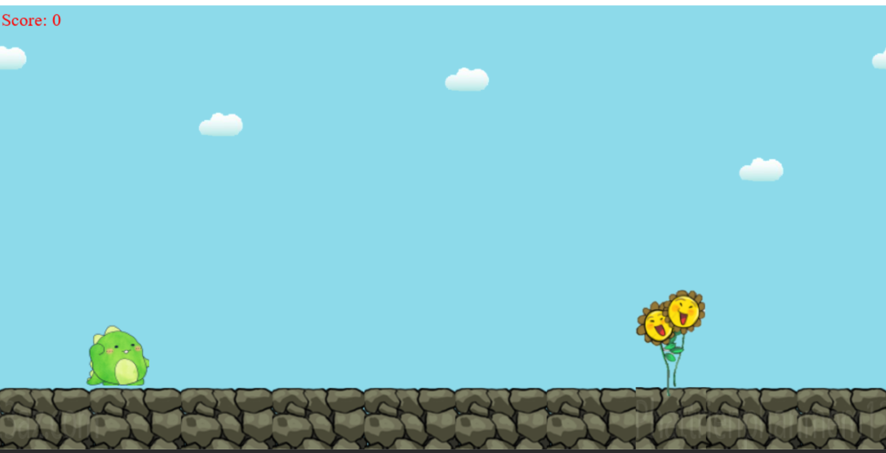 
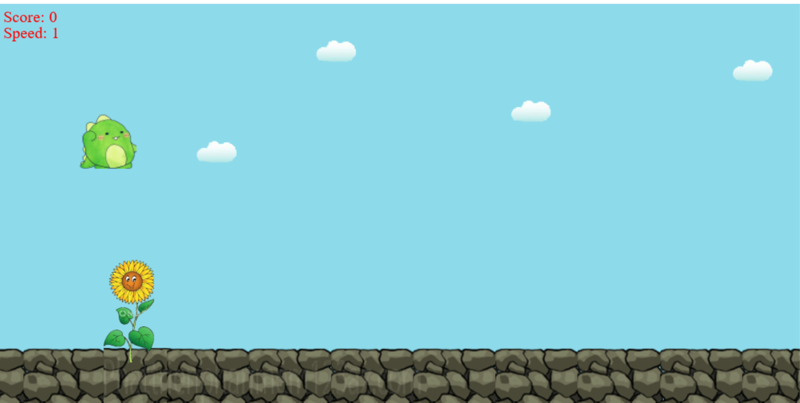 
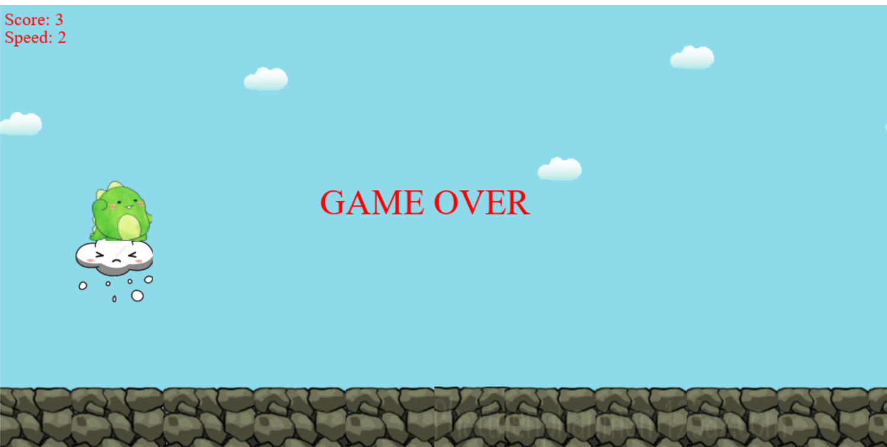

<h2> Instructions for using source code </h2>

Bước 1: Open Web Browser => Download Python: https://www.python.org/downloads/ 

 

Bước 2: Go to the folder containing the file you just downloaded => Proceed to install Python

Bước 3: Search Python from the search bar => Open file location  

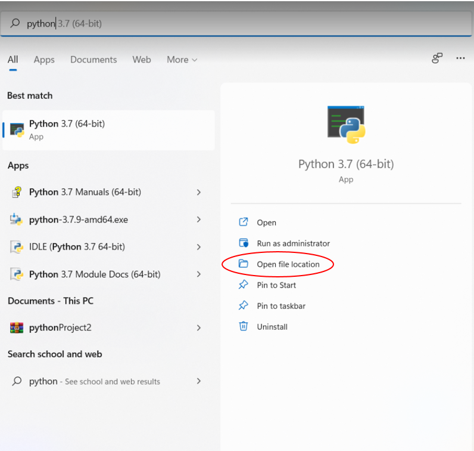 

Bước 4: A folder appears => Right click on python => Open file location  

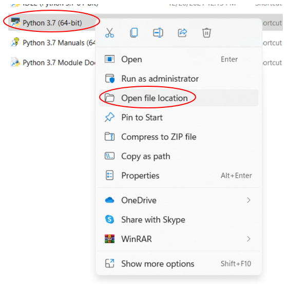 

Bước 5: Copy the address where Python is located  

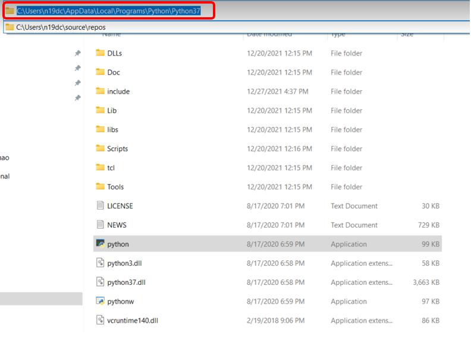 

Bước 6: Set Path for Python  

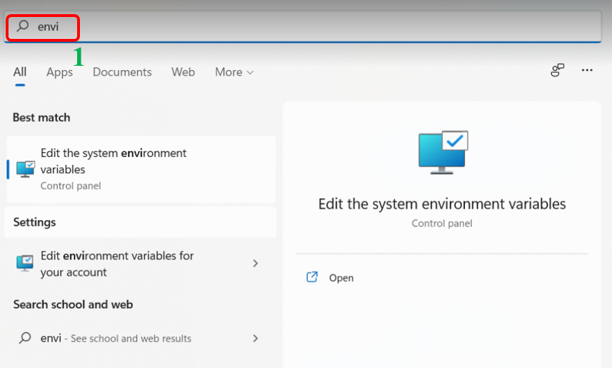 
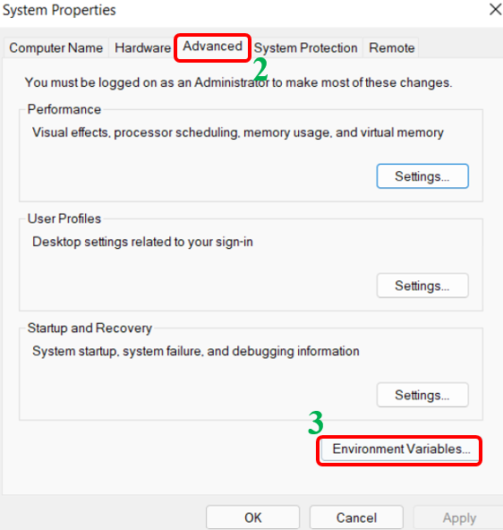 
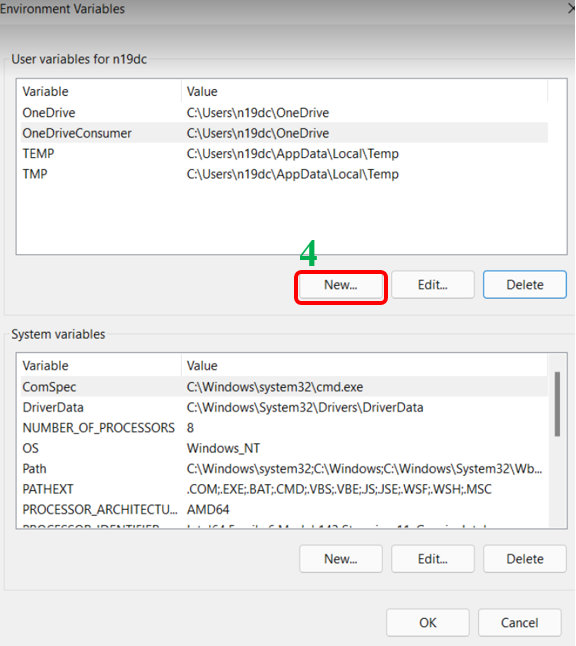 
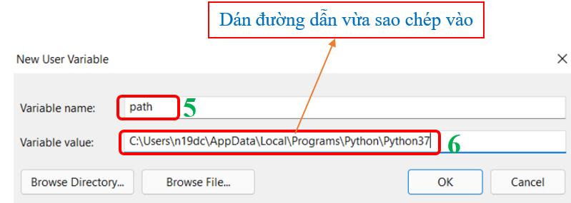 

Bước 7: Download the code from github and use the code: https://github.com/tranthuyvy/DinosaurGame.git  

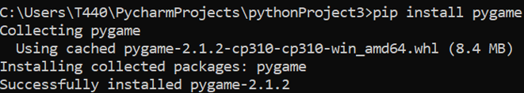 
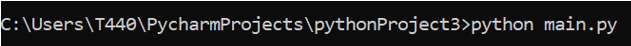 
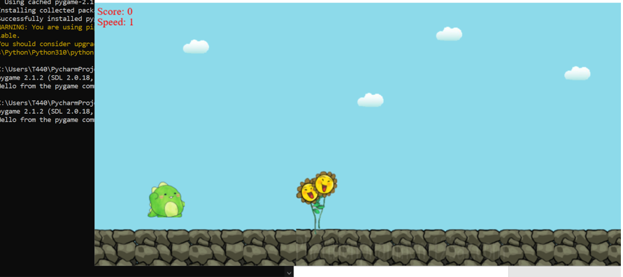 

# Using
    - Python
    - Pygame
